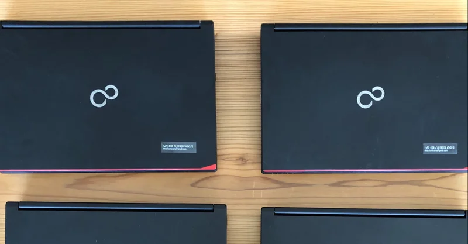
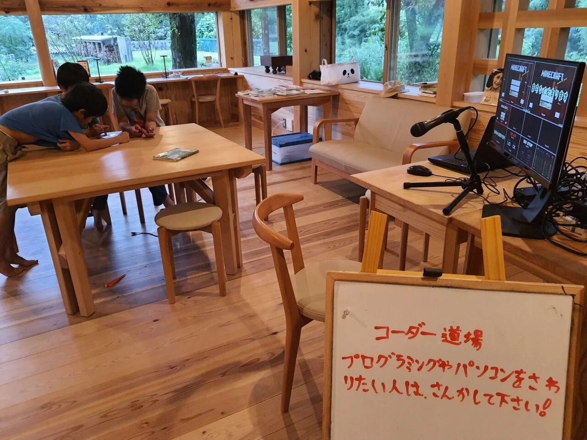
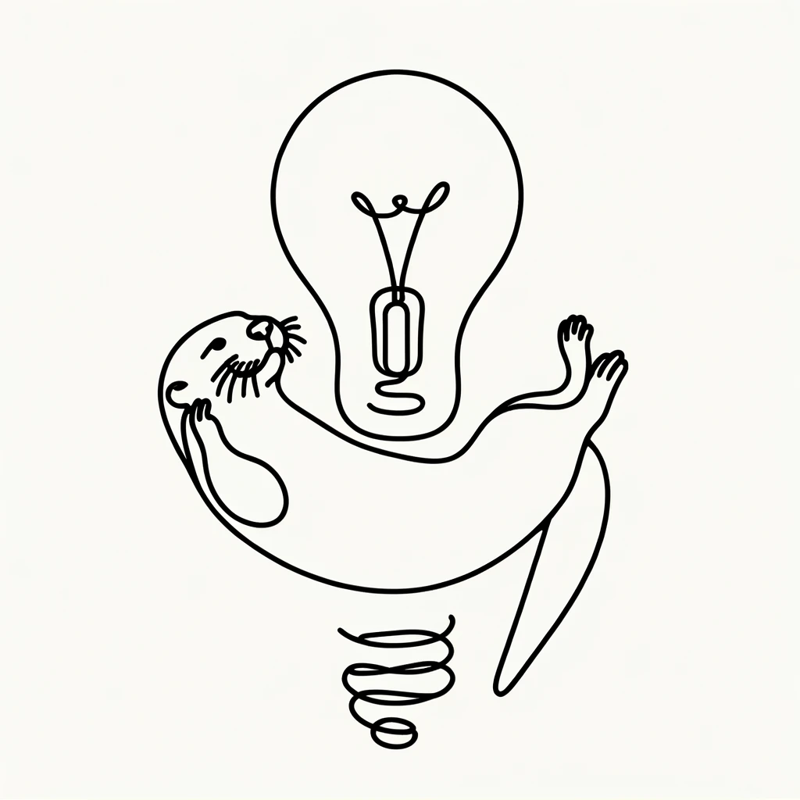

<!--
headingDivider: 1
-->

<!--
 - class: normal / blue / green / red / kintone / purple
-->

<!--
class: green
-->

#
#### 1. 自己紹介と神山のプレイヤーたち
#### 2. **テクノロジーで遊ぶ未来を作る**
#### 3. リモートワークとデジタルリテラシー

#
## テクノロジーで遊ぶ未来?

<!-- ##### STEM教育 ⇨ STE**A**M教育 -->

#

#
## デジタルファブリケーション施設
- 3Dプリンタ
- レーザーカッター
- カッティングプロッター
- デジタルミシン
- CNC
- etc...

#

>>> 日本のファブ施設調査2023——定着と代謝を経て | fabcross
>>> https://fabcross.jp/topics/research/20231225_fabspace.html

#
## 神山メイカースペース(2015～)
10人の**ものづくり仲間**と立ち上げました

# ミッション
## 『**ものづくり**』の灯台となる

#
## 2015年
##### 神山町とグリーンバレーが機材と場所を用意
##### **Makers**と呼ばれる愛好家が集結
## 

#

#

#
## 神山の小学校から
## 授業のご依頼

# 校長『多様な働き方を知ってほしい』
## 特別授業(2015年~)
- レーザーカッターとものづくり / あべさやか
- 3Dプリンタでフリスビーを作って遊ぶ / 寺田天志
- ドローンの科学実験室 / 本橋大輔

#

#

# ドローンで科学を学ぶ
## ドローン実験室(2015～2023)

# 

<!-- #

 -->

#
## アルゴリズム実験室(2022～)

#
## 迷路の最短経路を求める

# クリエイティブに遊ぶ**刺激**にしたかったけど…
## 年１回の授業は
## ただの体験で終わる

##### 毎年、別の子に同じことを教えている

# 当時、神山の子供たちのほとんどは
## パソコンで遊ぶ経験がなかった

#

>>> 学研教育総合研究所 小学生白書30年史
>>> https://www.gakken.jp/kyouikusouken/whitepaper/30history/chapter2/02.html

#

| デバイス | 2017年 | 2018年 | 2019年 |
| --- | --- | --- | --- |
| パソコン（家族と共有） | 37.4 | 27.4 | 25.4 |
| パソコン（子ども専用） | 3.3 | 3.7 | 2.7 |
| 自由に使えるものはない | 27.2 | 23.9 | 22.8 |

#####  (単位: %)
>>> 学研教育総合研究所 小学生白書30年史
>>> https://www.gakken.jp/kyouikusouken/whitepaper/30history/chapter2/02.html

#
## 長男誕生(2018)

# 彼が小学生になるまでに
## コンピューターで遊べる
## 下地を作っておきたい

#

#

#

## 🇮🇪 アイルランドで発足(2011)
## 🌍️ 世界で**2000**以上の道場
## 🇯🇵 日本にも約**200**の道場

#

#
## コーダー道場神山(2018年12月)

<!--  -->

# 空っぽの建物から始まりました(2018)

- 空きビル
- 使われてないパソコン
- 処分する机と椅子

# やがて改装も進みます(2019年10月)
- 株式会社モノサスのWork101として始動
- snowpeakのキャンピングオフィス

# コロナ禍中の開催(2020年2月)
- 消毒薬の設置
- リモート参加の推奨

そういえばアルコール手に入らなかったなぁ…

# ノートパソコンを10台寄付していただいた！(2020年4月)
- ChromeOS(CloudReady)を入れて貸し出し
- kintoneで機材管理

# 鮎喰川コモンに移転(2020年11月)

<!--  -->

# マイクラのライブ配信(2021年6月)

# 3Dプリンタでクリスマスオーナメント(2021年12月)

# 生成AIでイラスト遊び(2022年10月)

# オリジナルステッカー(2023年8月)
<!--  -->

# 社員研修として出張開催(2024年3月)

<!-- # 再びパソコンの寄付！(2024年3月)
株式会社えんがわさまから4K映像編集用PCを2台いただきました

 -->

#
## 最近のCoderDojoの取り組み

#

#

# 今年のプロジェクト
## 神山町伝統
## 正月の松飾り
## Scan & Print

#

#
## デジタル技術で遊ぶ

#

#
<!-- ## CoderDojoのきっかけ(2018) -->

#
## 先月のCoderDojo神山(2024)
## 👈️　　　　　　　　👉️

#
## 2015 ~ 2024

# ひとやすみ

# 次のパートでは
## リモートワークとデジタルリテラシーについてお話します

# たとえばこんなご質問

- 他のMakersはどんな活動をしていますか？
- 神山メイカースペースは他にどんな活動をしていますか？
- CoderDojo神山は他にどんな活動をしていますか？

<!-- 
#
## ご清聴ありがとうございました

 -->
